Bike rental
================

``` r
library(rio)
library(formattable)
```

    ## Warning: package 'formattable' was built under R version 3.6.3

``` r
library(dplyr)
```

    ## 
    ## Attaching package: 'dplyr'

    ## The following objects are masked from 'package:stats':
    ## 
    ##     filter, lag

    ## The following objects are masked from 'package:base':
    ## 
    ##     intersect, setdiff, setequal, union

``` r
library(tidyverse)
```

    ## Warning: package 'tidyverse' was built under R version 3.6.3

    ## -- Attaching packages ---------------------------------- tidyverse 1.3.0 --

    ## v ggplot2 3.3.3     v purrr   0.3.4
    ## v tibble  3.0.6     v stringr 1.4.0
    ## v tidyr   1.1.2     v forcats 0.4.0
    ## v readr   1.3.1

    ## Warning: package 'ggplot2' was built under R version 3.6.3

    ## Warning: package 'tidyr' was built under R version 3.6.3

    ## Warning: package 'purrr' was built under R version 3.6.3

    ## -- Conflicts ------------------------------------- tidyverse_conflicts() --
    ## x dplyr::filter() masks stats::filter()
    ## x dplyr::lag()    masks stats::lag()

``` r
library(readxl)
library(corrplot)
```

    ## corrplot 0.84 loaded

``` r
library(stargazer)
```

    ## 
    ## Please cite as:

    ##  Hlavac, Marek (2018). stargazer: Well-Formatted Regression and Summary Statistics Tables.

    ##  R package version 5.2.2. https://CRAN.R-project.org/package=stargazer

``` r
library(car)
```

    ## Warning: package 'car' was built under R version 3.6.3

    ## Loading required package: carData

    ## Warning: package 'carData' was built under R version 3.6.3

    ## 
    ## Attaching package: 'car'

    ## The following object is masked from 'package:purrr':
    ## 
    ##     some

    ## The following object is masked from 'package:dplyr':
    ## 
    ##     recode

``` r
library(PerformanceAnalytics)
```

    ## Warning: package 'PerformanceAnalytics' was built under R version 3.6.3

    ## Loading required package: xts

    ## Loading required package: zoo

    ## 
    ## Attaching package: 'zoo'

    ## The following objects are masked from 'package:base':
    ## 
    ##     as.Date, as.Date.numeric

    ## Registered S3 method overwritten by 'xts':
    ##   method     from
    ##   as.zoo.xts zoo

    ## 
    ## Attaching package: 'xts'

    ## The following objects are masked from 'package:dplyr':
    ## 
    ##     first, last

    ## 
    ## Attaching package: 'PerformanceAnalytics'

    ## The following object is masked from 'package:graphics':
    ## 
    ##     legend

``` r
library(tidyr)
library(tm)
```

    ## Warning: package 'tm' was built under R version 3.6.3

    ## Loading required package: NLP

    ## Warning: package 'NLP' was built under R version 3.6.3

    ## 
    ## Attaching package: 'NLP'

    ## The following object is masked from 'package:ggplot2':
    ## 
    ##     annotate

``` r
library(MASS)
```

    ## 
    ## Attaching package: 'MASS'

    ## The following object is masked from 'package:dplyr':
    ## 
    ##     select

    ## The following object is masked from 'package:formattable':
    ## 
    ##     area

``` r
library(AER)
```

    ## Warning: package 'AER' was built under R version 3.6.3

    ## Loading required package: lmtest

    ## Loading required package: sandwich

    ## Loading required package: survival

    ## Warning: package 'survival' was built under R version 3.6.3

``` r
library(ggplot2)
library(lubridate)
```

    ## Warning: package 'lubridate' was built under R version 3.6.3

    ## 
    ## Attaching package: 'lubridate'

    ## The following objects are masked from 'package:base':
    ## 
    ##     date, intersect, setdiff, union

``` r
#library(hrbrthemes)

options(scipen = 999)
```

Importing Data

``` r
#importing data
df<-read_xlsx("Bikeshare.xlsx",sheet = "Data")
```

``` r
df$total<-df$casual+df$registered
```

``` r
df$day <- weekdays(as.Date(df$date))
df$month<-months(df$date)
```

Subsetting data

``` r
#subsetting data
summary(df)
```

    ##     season             holiday           workday          weather     
    ##  Length:10886       Min.   :0.00000   Min.   :0.0000   Min.   :1.000  
    ##  Class :character   1st Qu.:0.00000   1st Qu.:0.0000   1st Qu.:1.000  
    ##  Mode  :character   Median :0.00000   Median :1.0000   Median :1.000  
    ##                     Mean   :0.02857   Mean   :0.6809   Mean   :1.418  
    ##                     3rd Qu.:0.00000   3rd Qu.:1.0000   3rd Qu.:2.000  
    ##                     Max.   :1.00000   Max.   :1.0000   Max.   :4.000  
    ##       temp           fltemp         humidity        windspeed     
    ##  Min.   : 0.82   Min.   : 0.76   Min.   :  0.00   Min.   : 0.000  
    ##  1st Qu.:13.94   1st Qu.:16.66   1st Qu.: 47.00   1st Qu.: 7.002  
    ##  Median :20.50   Median :24.24   Median : 62.00   Median :12.998  
    ##  Mean   :20.23   Mean   :23.66   Mean   : 61.89   Mean   :12.799  
    ##  3rd Qu.:26.24   3rd Qu.:31.06   3rd Qu.: 77.00   3rd Qu.:16.998  
    ##  Max.   :41.00   Max.   :45.45   Max.   :100.00   Max.   :56.997  
    ##      casual         registered        count      
    ##  Min.   :  0.00   Min.   :  0.0   Min.   :  1.0  
    ##  1st Qu.:  4.00   1st Qu.: 36.0   1st Qu.: 42.0  
    ##  Median : 17.00   Median :118.0   Median :145.0  
    ##  Mean   : 36.02   Mean   :155.6   Mean   :191.6  
    ##  3rd Qu.: 49.00   3rd Qu.:222.0   3rd Qu.:284.0  
    ##  Max.   :367.00   Max.   :886.0   Max.   :977.0  
    ##       date                          hour           total      
    ##  Min.   :2011-01-01 00:00:00   Min.   : 0.00   Min.   :  1.0  
    ##  1st Qu.:2011-07-02 00:00:00   1st Qu.: 6.00   1st Qu.: 42.0  
    ##  Median :2012-01-01 00:00:00   Median :12.00   Median :145.0  
    ##  Mean   :2011-12-26 18:23:52   Mean   :11.54   Mean   :191.6  
    ##  3rd Qu.:2012-07-01 00:00:00   3rd Qu.:18.00   3rd Qu.:284.0  
    ##  Max.   :2012-12-19 00:00:00   Max.   :23.00   Max.   :977.0  
    ##      day               month          
    ##  Length:10886       Length:10886      
    ##  Class :character   Class :character  
    ##  Mode  :character   Mode  :character  
    ##                                       
    ##                                       
    ## 

``` r
df<-df[ which(df$weather!=4), ]
df2<-df[ which(df$casual!=0), ]
```

Converting to factor and releveling

``` r
df$weather<-as.factor(df$weather)
summary(df$weather)
```

    ##    1    2    3 
    ## 7192 2834  859

``` r
df$day<-as.factor(df$day)
df$month<-as.factor(df$month)
df$holiday<-as.factor(df$holiday)
df$workday<-as.factor(df$workday)
df$season<-as.factor(df$season)
df$hour<-as.factor(df$hour)
df$day<-relevel(df$day,"Sunday")
df$month<-relevel(df$month,"January")
```

``` r
df2$weather<-as.factor(df2$weather)
df2$day<-as.factor(df2$day)
df2$month<-as.factor(df2$month)
df2$holiday<-as.factor(df2$holiday)
df2$workday<-as.factor(df2$workday)
df2$season<-as.factor(df2$season)
df2$hour<-as.factor(df2$hour)
df2$day<-relevel(df2$day,"Sunday")
df2$month<-relevel(df2$month,"January")
```

Sample Categorized Scatter Plot

``` r
numerics=df[c('temp','fltemp','humidity','windspeed','casual','registered','total')]
correlations=cor(numerics)
corrplot(correlations,method = "square",type="upper")
```

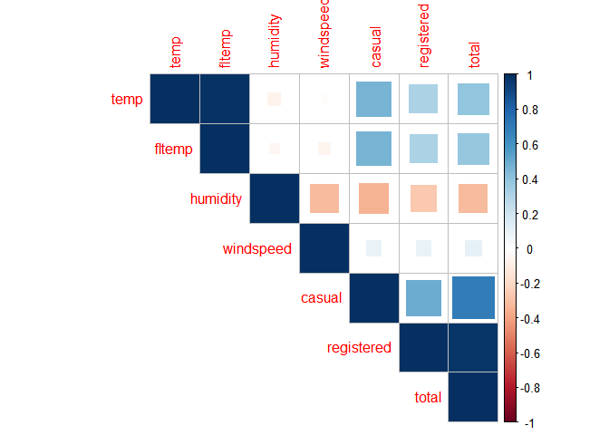<!-- -->

Normal Histogram

``` r
ggplot(df, aes(x=df$total)) + geom_histogram(color="coral",fill="coral")+ggtitle("Histogram of total rentals")+xlab("Total Rentals")
```

    ## Warning: Use of `df$total` is discouraged. Use `total` instead.

    ## `stat_bin()` using `bins = 30`. Pick better value with `binwidth`.

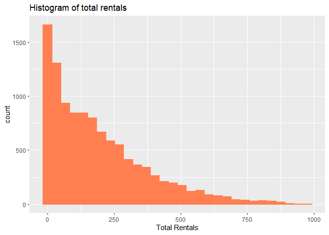<!-- -->

``` r
ggplot(df, aes(x=log(df$total))) + geom_histogram(color="coral",fill="coral")+ggtitle("Histogram of Log of total rentals")+xlab("Log of Total Rentals")
```

    ## Warning: Use of `df$total` is discouraged. Use `total` instead.

    ## `stat_bin()` using `bins = 30`. Pick better value with `binwidth`.

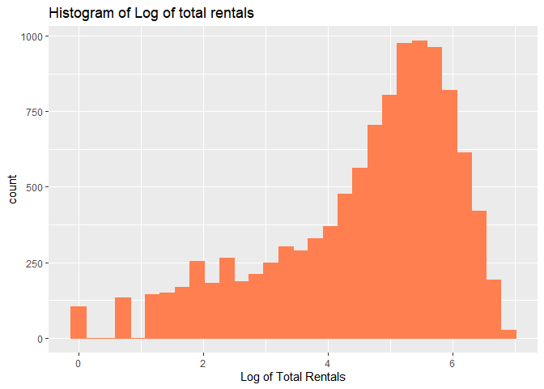<!-- -->

``` r
ggplot(df, aes(x=df$casual)) + geom_histogram(color="coral",fill="coral")+ggtitle("Histogram of casual rentals")+xlab("Casual Rentals")
```

    ## Warning: Use of `df$casual` is discouraged. Use `casual` instead.

    ## `stat_bin()` using `bins = 30`. Pick better value with `binwidth`.

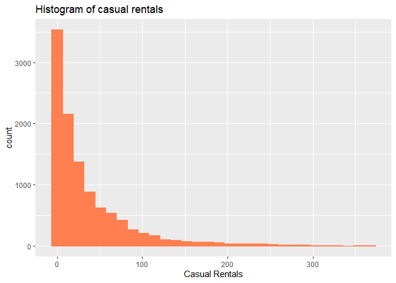<!-- -->

``` r
ggplot(df, aes(x=log(df$casual))) + geom_histogram(color="coral",fill="coral")+ggtitle("Histogram of Log of casual rentals")+xlab("Log of Casual Rentals")
```

    ## Warning: Use of `df$casual` is discouraged. Use `casual` instead.

    ## `stat_bin()` using `bins = 30`. Pick better value with `binwidth`.

    ## Warning: Removed 986 rows containing non-finite values (stat_bin).

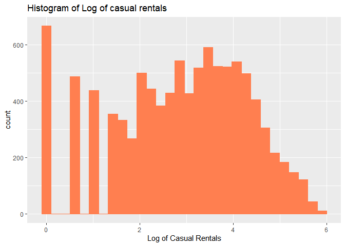<!-- -->

``` r
ggplot(df, aes(x=df$registered)) + geom_histogram(color="coral",fill="coral")+ggtitle("Histogram of registered rentals")+xlab("Registered Rentals")
```

    ## Warning: Use of `df$registered` is discouraged. Use `registered` instead.

    ## `stat_bin()` using `bins = 30`. Pick better value with `binwidth`.

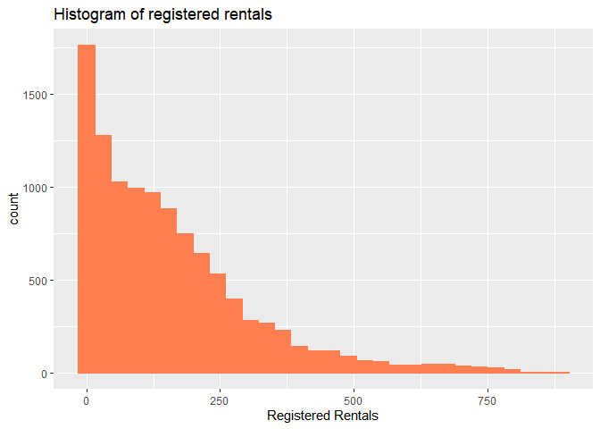<!-- -->

``` r
ggplot(df, aes(x=log(df$registered))) + geom_histogram(color="coral",fill="coral")+ggtitle("Histogram of Log registered rentals")+xlab("Log of Registered Rentals")
```

    ## Warning: Use of `df$registered` is discouraged. Use `registered` instead.

    ## `stat_bin()` using `bins = 30`. Pick better value with `binwidth`.

    ## Warning: Removed 15 rows containing non-finite values (stat_bin).

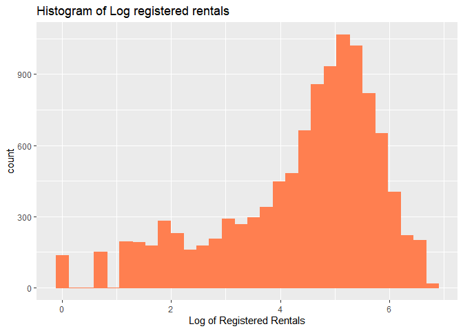<!-- -->

``` r
length(which(df$total==0))
```

    ## [1] 0

``` r
length(which(df$casual==0))
```

    ## [1] 986

``` r
length(which(df$registered==0))
```

    ## [1] 15

Category Boxplots

``` r
df %>%
  group_by(weather) %>%
  ggplot()+
  geom_boxplot(aes(x=weather,y=total,fill="coral"))+
  guides(fill=FALSE)
```

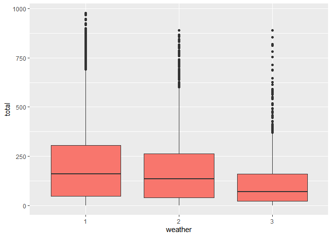<!-- -->

``` r
df %>%
  group_by(workday) %>%
  ggplot()+
  geom_boxplot(aes(x=workday,y=total,fill="coral"))+
  guides(fill=FALSE)
```

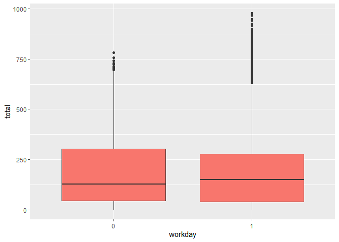<!-- -->

``` r
df %>%
  group_by(month) %>%
  ggplot()+
  geom_boxplot(aes(x=month,y=total,fill="coral"))+
  guides(fill=FALSE)
```

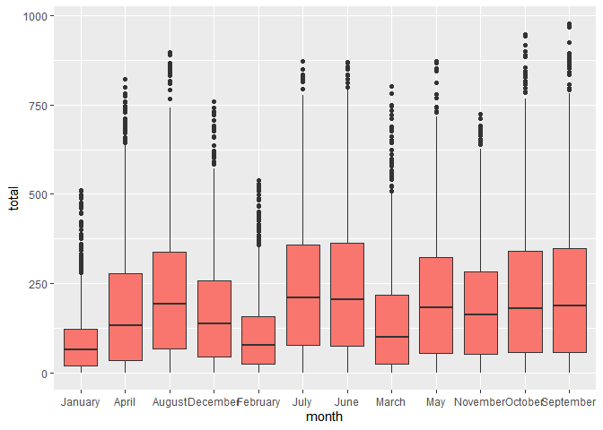<!-- -->

``` r
df %>%
  group_by(hour) %>%
  ggplot()+
  geom_boxplot(aes(x=hour,y=total,fill="coral"))+
  guides(fill=FALSE)
```

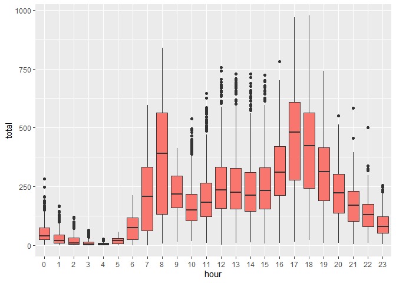<!-- -->

``` r
df %>%
  group_by(season) %>%
  ggplot()+
  geom_boxplot(aes(x=season,y=total,fill="coral"))+
  guides(fill=FALSE)
```

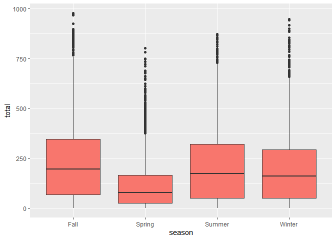<!-- -->

``` r
df %>%
  group_by(day) %>%
  ggplot()+
  geom_boxplot(aes(x=day,y=total,fill="coral"))+
  guides(fill=FALSE)
```

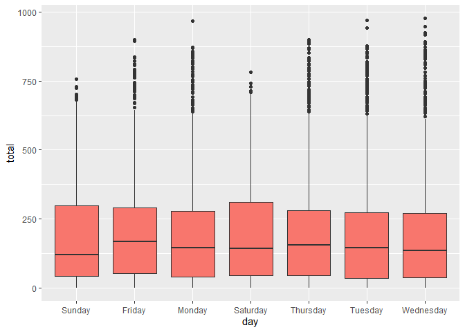<!-- -->

GLM assumption tests

``` r
#dispersiontest(reg2)
#durbinWatsonTest()
```

OLS Regression Model

``` r
#reg1<-lm(formula = medexpense~healthins+age+illnesses+logincome+agesqrd+healthscore+female+ssiratio+private+prioritylist+midincome+lowincome+vgh+fph+blackhisp+firmsize,data=df)
#summary(reg1)
#vif1<-vif(reg1)
```

GLM Model

``` r
reg1<-glm(formula=total~weather+day+fltemp+windspeed+humidity+hour+month,data=df,family = poisson)
summary(reg1)
```

    ## 
    ## Call:
    ## glm(formula = total ~ weather + day + fltemp + windspeed + humidity + 
    ##     hour + month, family = poisson, data = df)
    ## 
    ## Deviance Residuals: 
    ##     Min       1Q   Median       3Q      Max  
    ## -23.806   -4.485   -1.145    3.100   26.279  
    ## 
    ## Coefficients:
    ##                   Estimate  Std. Error z value             Pr(>|z|)    
    ## (Intercept)     3.25789985  0.00848951  383.76 < 0.0000000000000002 ***
    ## weather2       -0.03446251  0.00176570  -19.52 < 0.0000000000000002 ***
    ## weather3       -0.44439525  0.00352326 -126.13 < 0.0000000000000002 ***
    ## dayFriday       0.07986127  0.00262695   30.40 < 0.0000000000000002 ***
    ## dayMonday       0.01720043  0.00263790    6.52      0.0000000000701 ***
    ## daySaturday     0.07934118  0.00260343   30.48 < 0.0000000000000002 ***
    ## dayThursday     0.06361270  0.00262012   24.28 < 0.0000000000000002 ***
    ## dayTuesday      0.03483814  0.00264470   13.17 < 0.0000000000000002 ***
    ## dayWednesday    0.05503479  0.00264128   20.84 < 0.0000000000000002 ***
    ## fltemp          0.02603584  0.00018429  141.28 < 0.0000000000000002 ***
    ## windspeed      -0.00232984  0.00009066  -25.70 < 0.0000000000000002 ***
    ## humidity       -0.00438315  0.00005151  -85.09 < 0.0000000000000002 ***
    ## hour1          -0.46274189  0.01024331  -45.17 < 0.0000000000000002 ***
    ## hour2          -0.85142554  0.01172064  -72.64 < 0.0000000000000002 ***
    ## hour3          -1.51448746  0.01537439  -98.51 < 0.0000000000000002 ***
    ## hour4          -2.09615712  0.01982688 -105.72 < 0.0000000000000002 ***
    ## hour5          -0.95855413  0.01232665  -77.76 < 0.0000000000000002 ***
    ## hour6           0.40873531  0.00829877   49.25 < 0.0000000000000002 ***
    ## hour7           1.42053517  0.00709030  200.35 < 0.0000000000000002 ***
    ## hour8           1.91083086  0.00677861  281.89 < 0.0000000000000002 ***
    ## hour9           1.37265540  0.00706271  194.35 < 0.0000000000000002 ***
    ## hour10          1.09053715  0.00726333  150.14 < 0.0000000000000002 ***
    ## hour11          1.22531037  0.00714168  171.57 < 0.0000000000000002 ***
    ## hour12          1.38911398  0.00704171  197.27 < 0.0000000000000002 ***
    ## hour13          1.36326889  0.00706827  192.87 < 0.0000000000000002 ***
    ## hour14          1.29207679  0.00712808  181.27 < 0.0000000000000002 ***
    ## hour15          1.33699783  0.00710622  188.15 < 0.0000000000000002 ***
    ## hour16          1.56060519  0.00697593  223.71 < 0.0000000000000002 ***
    ## hour17          1.98435042  0.00678892  292.29 < 0.0000000000000002 ***
    ## hour18          1.92187964  0.00679195  282.96 < 0.0000000000000002 ***
    ## hour19          1.63492472  0.00689009  237.29 < 0.0000000000000002 ***
    ## hour20          1.34244440  0.00705912  190.17 < 0.0000000000000002 ***
    ## hour21          1.08936954  0.00725718  150.11 < 0.0000000000000002 ***
    ## hour22          0.85281414  0.00750621  113.61 < 0.0000000000000002 ***
    ## hour23          0.48161868  0.00802376   60.02 < 0.0000000000000002 ***
    ## monthApril      0.43866368  0.00477592   91.85 < 0.0000000000000002 ***
    ## monthAugust     0.42093073  0.00575584   73.13 < 0.0000000000000002 ***
    ## monthDecember   0.60255454  0.00447389  134.68 < 0.0000000000000002 ***
    ## monthFebruary   0.12788214  0.00479706   26.66 < 0.0000000000000002 ***
    ## monthJuly       0.34623636  0.00597131   57.98 < 0.0000000000000002 ***
    ## monthJune       0.48443478  0.00547653   88.46 < 0.0000000000000002 ***
    ## monthMarch      0.29590344  0.00471771   62.72 < 0.0000000000000002 ***
    ## monthMay        0.55894615  0.00506061  110.45 < 0.0000000000000002 ***
    ## monthNovember   0.61231586  0.00444264  137.83 < 0.0000000000000002 ***
    ## monthOctober    0.67220678  0.00486153  138.27 < 0.0000000000000002 ***
    ## monthSeptember  0.56651255  0.00537027  105.49 < 0.0000000000000002 ***
    ## ---
    ## Signif. codes:  0 '***' 0.001 '**' 0.01 '*' 0.05 '.' 0.1 ' ' 1
    ## 
    ## (Dispersion parameter for poisson family taken to be 1)
    ## 
    ##     Null deviance: 1800563  on 10884  degrees of freedom
    ## Residual deviance:  455920  on 10839  degrees of freedom
    ## AIC: 525652
    ## 
    ## Number of Fisher Scoring iterations: 5

``` r
vif1<-vif(reg1)
dispersiontest(reg1)
```

    ## 
    ##  Overdispersion test
    ## 
    ## data:  reg1
    ## z = 56.209, p-value < 0.00000000000000022
    ## alternative hypothesis: true dispersion is greater than 1
    ## sample estimates:
    ## dispersion 
    ##   42.48527

``` r
durbinWatsonTest(reg1)
```

    ##  lag Autocorrelation D-W Statistic p-value
    ##    1       0.8007998     0.3983853       0
    ##  Alternative hypothesis: rho != 0

Negative Binomial Model

``` r
reg2<-glm.nb(formula=total~weather+day+humidity+windspeed+hour+month,data=df)
summary(reg2)
```

    ## 
    ## Call:
    ## glm.nb(formula = total ~ weather + day + humidity + windspeed + 
    ##     hour + month, data = df, init.theta = 3.035372736, link = log)
    ## 
    ## Deviance Residuals: 
    ##     Min       1Q   Median       3Q      Max  
    ## -4.2492  -0.8092  -0.1587   0.4738   5.0457  
    ## 
    ## Coefficients:
    ##                  Estimate Std. Error z value             Pr(>|z|)    
    ## (Intercept)     3.7002495  0.0461940  80.102 < 0.0000000000000002 ***
    ## weather2       -0.0149002  0.0140291  -1.062                0.288    
    ## weather3       -0.4679165  0.0239643 -19.526 < 0.0000000000000002 ***
    ## dayFriday      -0.1730056  0.0212030  -8.159 0.000000000000000336 ***
    ## dayMonday      -0.2485444  0.0211061 -11.776 < 0.0000000000000002 ***
    ## daySaturday     0.0102508  0.0209496   0.489                0.625    
    ## dayThursday    -0.1952369  0.0211787  -9.219 < 0.0000000000000002 ***
    ## dayTuesday     -0.2533841  0.0211859 -11.960 < 0.0000000000000002 ***
    ## dayWednesday   -0.2311541  0.0211470 -10.931 < 0.0000000000000002 ***
    ## humidity       -0.0045065  0.0004093 -11.011 < 0.0000000000000002 ***
    ## windspeed      -0.0044055  0.0007543  -5.840 0.000000005208286414 ***
    ## hour1          -0.4823758  0.0397151 -12.146 < 0.0000000000000002 ***
    ## hour2          -0.8787799  0.0403219 -21.794 < 0.0000000000000002 ***
    ## hour3          -1.5354044  0.0419717 -36.582 < 0.0000000000000002 ***
    ## hour4          -2.0824837  0.0436956 -47.659 < 0.0000000000000002 ***
    ## hour5          -0.8985276  0.0403163 -22.287 < 0.0000000000000002 ***
    ## hour6           0.4890517  0.0391391  12.495 < 0.0000000000000002 ***
    ## hour7           1.5103406  0.0388566  38.870 < 0.0000000000000002 ***
    ## hour8           2.0541531  0.0387807  52.968 < 0.0000000000000002 ***
    ## hour9           1.5123316  0.0388811  38.896 < 0.0000000000000002 ***
    ## hour10          1.1775966  0.0390357  30.167 < 0.0000000000000002 ***
    ## hour11          1.3349679  0.0391704  34.081 < 0.0000000000000002 ***
    ## hour12          1.5310613  0.0393242  38.934 < 0.0000000000000002 ***
    ## hour13          1.5254579  0.0395086  38.611 < 0.0000000000000002 ***
    ## hour14          1.4632137  0.0396575  36.896 < 0.0000000000000002 ***
    ## hour15          1.5195985  0.0396833  38.293 < 0.0000000000000002 ***
    ## hour16          1.7538909  0.0396084  44.281 < 0.0000000000000002 ***
    ## hour17          2.1924190  0.0394610  55.559 < 0.0000000000000002 ***
    ## hour18          2.1193381  0.0393288  53.888 < 0.0000000000000002 ***
    ## hour19          1.7899857  0.0390675  45.818 < 0.0000000000000002 ***
    ## hour20          1.4686500  0.0389722  37.685 < 0.0000000000000002 ***
    ## hour21          1.1980647  0.0389135  30.788 < 0.0000000000000002 ***
    ## hour22          0.9364807  0.0389331  24.054 < 0.0000000000000002 ***
    ## hour23          0.5366429  0.0390430  13.745 < 0.0000000000000002 ***
    ## monthApril      0.6435400  0.0281751  22.841 < 0.0000000000000002 ***
    ## monthAugust     0.9998162  0.0282408  35.403 < 0.0000000000000002 ***
    ## monthDecember   0.7294986  0.0285472  25.554 < 0.0000000000000002 ***
    ## monthFebruary   0.1810384  0.0284147   6.371 0.000000000187438054 ***
    ## monthJuly       1.0024835  0.0282023  35.546 < 0.0000000000000002 ***
    ## monthJune       0.9863933  0.0281296  35.066 < 0.0000000000000002 ***
    ## monthMarch      0.4416096  0.0283040  15.602 < 0.0000000000000002 ***
    ## monthMay        0.9348132  0.0284160  32.897 < 0.0000000000000002 ***
    ## monthNovember   0.7731998  0.0282006  27.418 < 0.0000000000000002 ***
    ## monthOctober    0.9882155  0.0285063  34.667 < 0.0000000000000002 ***
    ## monthSeptember  1.0274799  0.0286164  35.905 < 0.0000000000000002 ***
    ## ---
    ## Signif. codes:  0 '***' 0.001 '**' 0.01 '*' 0.05 '.' 0.1 ' ' 1
    ## 
    ## (Dispersion parameter for Negative Binomial(3.0354) family taken to be 1)
    ## 
    ##     Null deviance: 43404  on 10884  degrees of freedom
    ## Residual deviance: 11639  on 10840  degrees of freedom
    ## AIC: 120465
    ## 
    ## Number of Fisher Scoring iterations: 1
    ## 
    ## 
    ##               Theta:  3.0354 
    ##           Std. Err.:  0.0425 
    ## 
    ##  2 x log-likelihood:  -120373.1160

``` r
vif2<-vif(reg2)
durbinWatsonTest(reg2)
```

    ##  lag Autocorrelation D-W Statistic p-value
    ##    1       0.7974496      0.405036       0
    ##  Alternative hypothesis: rho != 0

``` r
vif2
```

    ##               GVIF Df GVIF^(1/(2*Df))
    ## weather   1.342169  2        1.076346
    ## day       1.036332  6        1.002978
    ## humidity  1.937092  1        1.391794
    ## windspeed 1.187102  1        1.089542
    ## hour      1.430437 23        1.007813
    ## month     1.188510 11        1.007881

``` r
reg3<-glm(formula=registered~weather+day+fltemp+windspeed+humidity+hour+month,data=df,family = poisson)
summary(reg3)
```

    ## 
    ## Call:
    ## glm(formula = registered ~ weather + day + fltemp + windspeed + 
    ##     humidity + hour + month, family = poisson, data = df)
    ## 
    ## Deviance Residuals: 
    ##     Min       1Q   Median       3Q      Max  
    ## -23.121   -4.187   -1.113    2.843   25.202  
    ## 
    ## Coefficients:
    ##                   Estimate  Std. Error z value            Pr(>|z|)    
    ## (Intercept)     2.99187169  0.00935518  319.81 <0.0000000000000002 ***
    ## weather2       -0.02895317  0.00194641  -14.88 <0.0000000000000002 ***
    ## weather3       -0.43515994  0.00382685 -113.71 <0.0000000000000002 ***
    ## dayFriday       0.28635272  0.00302408   94.69 <0.0000000000000002 ***
    ## dayMonday       0.22861660  0.00303585   75.31 <0.0000000000000002 ***
    ## daySaturday     0.06551321  0.00315199   20.79 <0.0000000000000002 ***
    ## dayThursday     0.31556237  0.00299266  105.45 <0.0000000000000002 ***
    ## dayTuesday      0.28704733  0.00301551   95.19 <0.0000000000000002 ***
    ## dayWednesday    0.30713486  0.00301097  102.00 <0.0000000000000002 ***
    ## fltemp          0.02184294  0.00020274  107.74 <0.0000000000000002 ***
    ## windspeed      -0.00192813  0.00010101  -19.09 <0.0000000000000002 ***
    ## humidity       -0.00377621  0.00005711  -66.12 <0.0000000000000002 ***
    ## hour1          -0.47207475  0.01138383  -41.47 <0.0000000000000002 ***
    ## hour2          -0.88558278  0.01313496  -67.42 <0.0000000000000002 ***
    ## hour3          -1.56967273  0.01742376  -90.09 <0.0000000000000002 ***
    ## hour4          -2.11619257  0.02211220  -95.70 <0.0000000000000002 ***
    ## hour5          -0.83896359  0.01304010  -64.34 <0.0000000000000002 ***
    ## hour6           0.54839387  0.00892932   61.41 <0.0000000000000002 ***
    ## hour7           1.56632331  0.00774727  202.18 <0.0000000000000002 ***
    ## hour8           2.05415946  0.00745060  275.70 <0.0000000000000002 ***
    ## hour9           1.43410760  0.00779002  184.09 <0.0000000000000002 ***
    ## hour10          1.00476694  0.00815379  123.23 <0.0000000000000002 ***
    ## hour11          1.11628233  0.00803023  139.01 <0.0000000000000002 ***
    ## hour12          1.30839177  0.00788290  165.98 <0.0000000000000002 ***
    ## hour13          1.25991596  0.00793142  158.85 <0.0000000000000002 ***
    ## hour14          1.15168568  0.00803309  143.37 <0.0000000000000002 ***
    ## hour15          1.21936057  0.00798627  152.68 <0.0000000000000002 ***
    ## hour16          1.52654396  0.00777123  196.44 <0.0000000000000002 ***
    ## hour17          2.04137376  0.00751516  271.63 <0.0000000000000002 ***
    ## hour18          1.99821014  0.00750975  266.08 <0.0000000000000002 ***
    ## hour19          1.69010352  0.00762028  221.79 <0.0000000000000002 ***
    ## hour20          1.38721991  0.00780521  177.73 <0.0000000000000002 ***
    ## hour21          1.12523208  0.00802285  140.25 <0.0000000000000002 ***
    ## hour22          0.87966482  0.00829882  106.00 <0.0000000000000002 ***
    ## hour23          0.50038065  0.00886963   56.41 <0.0000000000000002 ***
    ## monthApril      0.30786051  0.00518741   59.35 <0.0000000000000002 ***
    ## monthAugust     0.35405594  0.00625622   56.59 <0.0000000000000002 ***
    ## monthDecember   0.61930692  0.00471100  131.46 <0.0000000000000002 ***
    ## monthFebruary   0.13484763  0.00504068   26.75 <0.0000000000000002 ***
    ## monthJuly       0.27035804  0.00651201   41.52 <0.0000000000000002 ***
    ## monthJune       0.42178970  0.00595133   70.87 <0.0000000000000002 ***
    ## monthMarch      0.21663080  0.00507116   42.72 <0.0000000000000002 ***
    ## monthMay        0.47511875  0.00547131   86.84 <0.0000000000000002 ***
    ## monthNovember   0.58200908  0.00472207  123.25 <0.0000000000000002 ***
    ## monthOctober    0.60753517  0.00523523  116.05 <0.0000000000000002 ***
    ## monthSeptember  0.49539878  0.00581969   85.12 <0.0000000000000002 ***
    ## ---
    ## Signif. codes:  0 '***' 0.001 '**' 0.01 '*' 0.05 '.' 0.1 ' ' 1
    ## 
    ## (Dispersion parameter for poisson family taken to be 1)
    ## 
    ##     Null deviance: 1477765  on 10884  degrees of freedom
    ## Residual deviance:  375477  on 10839  degrees of freedom
    ## AIC: 443001
    ## 
    ## Number of Fisher Scoring iterations: 5

``` r
vif3<-vif(reg3)
dispersiontest(reg3)
```

    ## 
    ##  Overdispersion test
    ## 
    ## data:  reg3
    ## z = 58.733, p-value < 0.00000000000000022
    ## alternative hypothesis: true dispersion is greater than 1
    ## sample estimates:
    ## dispersion 
    ##   35.38019

``` r
durbinWatsonTest(reg3)
```

    ##  lag Autocorrelation D-W Statistic p-value
    ##    1       0.7955325     0.4089229       0
    ##  Alternative hypothesis: rho != 0

``` r
reg4<-glm.nb(formula=registered~weather+day+humidity+windspeed+hour+month,data=df)
summary(reg4)
```

    ## 
    ## Call:
    ## glm.nb(formula = registered ~ weather + day + humidity + windspeed + 
    ##     hour + month, data = df, init.theta = 2.958944898, link = log)
    ## 
    ## Deviance Residuals: 
    ##     Min       1Q   Median       3Q      Max  
    ## -4.1459  -0.8126  -0.1635   0.4804   4.7865  
    ## 
    ## Coefficients:
    ##                  Estimate Std. Error z value             Pr(>|z|)    
    ## (Intercept)     3.4898296  0.0469663  74.305 < 0.0000000000000002 ***
    ## weather2       -0.0065565  0.0142611  -0.460              0.64570    
    ## weather3       -0.4408294  0.0243565 -18.099 < 0.0000000000000002 ***
    ## dayFriday      -0.0419100  0.0215674  -1.943              0.05199 .  
    ## dayMonday      -0.1328062  0.0214754  -6.184       0.000000000625 ***
    ## daySaturday     0.0143563  0.0213381   0.673              0.50107    
    ## dayThursday    -0.0338083  0.0215349  -1.570              0.11643    
    ## dayTuesday     -0.0946854  0.0215438  -4.395       0.000011076677 ***
    ## dayWednesday   -0.0675158  0.0215016  -3.140              0.00169 ** 
    ## humidity       -0.0041163  0.0004160  -9.895 < 0.0000000000000002 ***
    ## windspeed      -0.0038677  0.0007663  -5.047       0.000000447916 ***
    ## hour1          -0.4750966  0.0404286 -11.751 < 0.0000000000000002 ***
    ## hour2          -0.8895871  0.0411322 -21.628 < 0.0000000000000002 ***
    ## hour3          -1.5699218  0.0430818 -36.441 < 0.0000000000000002 ***
    ## hour4          -2.1164539  0.0451356 -46.891 < 0.0000000000000002 ***
    ## hour5          -0.8243235  0.0409906 -20.110 < 0.0000000000000002 ***
    ## hour6           0.5697097  0.0397390  14.336 < 0.0000000000000002 ***
    ## hour7           1.5901601  0.0394433  40.315 < 0.0000000000000002 ***
    ## hour8           2.1257717  0.0393647  54.002 < 0.0000000000000002 ***
    ## hour9           1.5246121  0.0394786  38.619 < 0.0000000000000002 ***
    ## hour10          1.0778128  0.0396668  27.172 < 0.0000000000000002 ***
    ## hour11          1.2094530  0.0398019  30.387 < 0.0000000000000002 ***
    ## hour12          1.4237753  0.0399474  35.641 < 0.0000000000000002 ***
    ## hour13          1.3965155  0.0401386  34.792 < 0.0000000000000002 ***
    ## hour14          1.2968247  0.0402992  32.180 < 0.0000000000000002 ***
    ## hour15          1.3704052  0.0403203  33.988 < 0.0000000000000002 ***
    ## hour16          1.6751191  0.0402264  41.642 < 0.0000000000000002 ***
    ## hour17          2.1879181  0.0400627  54.612 < 0.0000000000000002 ***
    ## hour18          2.1351345  0.0399270  53.476 < 0.0000000000000002 ***
    ## hour19          1.7963995  0.0396652  45.289 < 0.0000000000000002 ***
    ## hour20          1.4708386  0.0395736  37.167 < 0.0000000000000002 ***
    ## hour21          1.1967316  0.0395200  30.282 < 0.0000000000000002 ***
    ## hour22          0.9315047  0.0395481  23.554 < 0.0000000000000002 ***
    ## hour23          0.5288259  0.0396769  13.328 < 0.0000000000000002 ***
    ## monthApril      0.4825585  0.0286436  16.847 < 0.0000000000000002 ***
    ## monthAugust     0.8539420  0.0286870  29.768 < 0.0000000000000002 ***
    ## monthDecember   0.7287175  0.0289631  25.160 < 0.0000000000000002 ***
    ## monthFebruary   0.1753469  0.0288366   6.081       0.000000001197 ***
    ## monthJuly       0.8271427  0.0286578  28.863 < 0.0000000000000002 ***
    ## monthJune       0.8504301  0.0285732  29.763 < 0.0000000000000002 ***
    ## monthMarch      0.3431529  0.0287574  11.933 < 0.0000000000000002 ***
    ## monthMay        0.7862683  0.0288676  27.237 < 0.0000000000000002 ***
    ## monthNovember   0.7195540  0.0286260  25.136 < 0.0000000000000002 ***
    ## monthOctober    0.8842662  0.0289456  30.549 < 0.0000000000000002 ***
    ## monthSeptember  0.8884702  0.0290679  30.565 < 0.0000000000000002 ***
    ## ---
    ## Signif. codes:  0 '***' 0.001 '**' 0.01 '*' 0.05 '.' 0.1 ' ' 1
    ## 
    ## (Dispersion parameter for Negative Binomial(2.9589) family taken to be 1)
    ## 
    ##     Null deviance: 41543  on 10884  degrees of freedom
    ## Residual deviance: 11710  on 10840  degrees of freedom
    ## AIC: 116564
    ## 
    ## Number of Fisher Scoring iterations: 1
    ## 
    ## 
    ##               Theta:  2.9589 
    ##           Std. Err.:  0.0419 
    ## 
    ##  2 x log-likelihood:  -116471.9890

``` r
vif4<-vif(reg4)
durbinWatsonTest(reg4)
```

    ##  lag Autocorrelation D-W Statistic p-value
    ##    1       0.7966064       0.40672       0
    ##  Alternative hypothesis: rho != 0

``` r
vif4
```

    ##               GVIF Df GVIF^(1/(2*Df))
    ## weather   1.343165  2        1.076545
    ## day       1.036451  6        1.002988
    ## humidity  1.937454  1        1.391925
    ## windspeed 1.186652  1        1.089336
    ## hour      1.429317 23        1.007795
    ## month     1.188370 11        1.007876

``` r
reg5<-glm.nb(formula=casual~weather+day+humidity+windspeed+hour+month,data=df2)
summary(reg5)
```

    ## 
    ## Call:
    ## glm.nb(formula = casual ~ weather + day + humidity + windspeed + 
    ##     hour + month, data = df2, init.theta = 3.376768629, link = log)
    ## 
    ## Deviance Residuals: 
    ##     Min       1Q   Median       3Q      Max  
    ## -3.7692  -0.8449  -0.1856   0.4642   5.5510  
    ## 
    ## Coefficients:
    ##                  Estimate Std. Error z value             Pr(>|z|)    
    ## (Intercept)     1.8594050  0.0527448  35.253 < 0.0000000000000002 ***
    ## weather2       -0.0702709  0.0152755  -4.600   0.0000042201657960 ***
    ## weather3       -0.6483655  0.0275012 -23.576 < 0.0000000000000002 ***
    ## dayFriday      -0.5906410  0.0224013 -26.366 < 0.0000000000000002 ***
    ## dayMonday      -0.6218406  0.0222720 -27.920 < 0.0000000000000002 ***
    ## daySaturday     0.0502049  0.0215469   2.330               0.0198 *  
    ## dayThursday    -0.8132436  0.0227408 -35.761 < 0.0000000000000002 ***
    ## dayTuesday     -0.8339007  0.0227707 -36.622 < 0.0000000000000002 ***
    ## dayWednesday   -0.8370046  0.0228439 -36.640 < 0.0000000000000002 ***
    ## humidity       -0.0060187  0.0004447 -13.536 < 0.0000000000000002 ***
    ## windspeed      -0.0052384  0.0008086  -6.478   0.0000000000929107 ***
    ## hour1          -0.3798085  0.0473876  -8.015   0.0000000000000011 ***
    ## hour2          -0.5955564  0.0499533 -11.922 < 0.0000000000000002 ***
    ## hour3          -1.0646950  0.0563792 -18.885 < 0.0000000000000002 ***
    ## hour4          -1.6150889  0.0649855 -24.853 < 0.0000000000000002 ***
    ## hour5          -1.6272796  0.0606513 -26.830 < 0.0000000000000002 ***
    ## hour6          -0.6972041  0.0488737 -14.265 < 0.0000000000000002 ***
    ## hour7           0.2428483  0.0440519   5.513   0.0000000353220353 ***
    ## hour8           0.8903331  0.0424592  20.969 < 0.0000000000000002 ***
    ## hour9           1.1063278  0.0421383  26.255 < 0.0000000000000002 ***
    ## hour10          1.4089019  0.0419405  33.593 < 0.0000000000000002 ***
    ## hour11          1.6304320  0.0418486  38.960 < 0.0000000000000002 ***
    ## hour12          1.7616603  0.0419893  41.955 < 0.0000000000000002 ***
    ## hour13          1.8122949  0.0421696  42.976 < 0.0000000000000002 ***
    ## hour14          1.8612860  0.0423098  43.992 < 0.0000000000000002 ***
    ## hour15          1.8674240  0.0423310  44.115 < 0.0000000000000002 ***
    ## hour16          1.8560387  0.0422864  43.892 < 0.0000000000000002 ***
    ## hour17          1.8873470  0.0421512  44.776 < 0.0000000000000002 ***
    ## hour18          1.6793138  0.0421217  39.868 < 0.0000000000000002 ***
    ## hour19          1.4395568  0.0419846  34.288 < 0.0000000000000002 ***
    ## hour20          1.1742723  0.0421719  27.845 < 0.0000000000000002 ***
    ## hour21          0.9654724  0.0423537  22.795 < 0.0000000000000002 ***
    ## hour22          0.7617380  0.0426982  17.840 < 0.0000000000000002 ***
    ## hour23          0.4264183  0.0434984   9.803 < 0.0000000000000002 ***
    ## monthApril      1.5195722  0.0329498  46.118 < 0.0000000000000002 ***
    ## monthAugust     1.8611599  0.0327171  56.886 < 0.0000000000000002 ***
    ## monthDecember   0.7140677  0.0344202  20.746 < 0.0000000000000002 ***
    ## monthFebruary   0.1985461  0.0352620   5.631   0.0000000179585510 ***
    ## monthJuly       1.9742123  0.0325717  60.611 < 0.0000000000000002 ***
    ## monthJune       1.8008703  0.0326250  55.199 < 0.0000000000000002 ***
    ## monthMarch      1.1068970  0.0335606  32.982 < 0.0000000000000002 ***
    ## monthMay        1.7746788  0.0330005  53.777 < 0.0000000000000002 ***
    ## monthNovember   1.1179623  0.0333920  33.480 < 0.0000000000000002 ***
    ## monthOctober    1.6163741  0.0332423  48.624 < 0.0000000000000002 ***
    ## monthSeptember  1.7932054  0.0331320  54.123 < 0.0000000000000002 ***
    ## ---
    ## Signif. codes:  0 '***' 0.001 '**' 0.01 '*' 0.05 '.' 0.1 ' ' 1
    ## 
    ## (Dispersion parameter for Negative Binomial(3.3768) family taken to be 1)
    ## 
    ##     Null deviance: 45438  on 9898  degrees of freedom
    ## Residual deviance: 10320  on 9854  degrees of freedom
    ## AIC: 76963
    ## 
    ## Number of Fisher Scoring iterations: 1
    ## 
    ## 
    ##               Theta:  3.3768 
    ##           Std. Err.:  0.0577 
    ## 
    ##  2 x log-likelihood:  -76870.6940

``` r
vif5<-vif(reg5)
durbinWatsonTest(reg5)
```

    ##  lag Autocorrelation D-W Statistic p-value
    ##    1       0.6619386     0.6760873       0
    ##  Alternative hypothesis: rho != 0

``` r
vif5
```

    ##               GVIF Df GVIF^(1/(2*Df))
    ## weather   1.360858  2        1.080073
    ## day       1.048966  6        1.003992
    ## humidity  1.931164  1        1.389663
    ## windspeed 1.176140  1        1.084500
    ## hour      1.474763 23        1.008481
    ## month     1.215179 11        1.008898

Starazer Outputs

``` r
stargazer(reg2,reg4,reg5,type="text",align = TRUE,single.row=TRUE,digits=2,out = "reg7.txt")
```

    ## 
    ## =========================================================================
    ##                                     Dependent variable:                  
    ##                   -------------------------------------------------------
    ##                         total            registered          casual      
    ##                          (1)                (2)                (3)       
    ## -------------------------------------------------------------------------
    ## weather2             -0.01 (0.01)       -0.01 (0.01)     -0.07*** (0.02) 
    ## weather3           -0.47*** (0.02)    -0.44*** (0.02)    -0.65*** (0.03) 
    ## dayFriday          -0.17*** (0.02)     -0.04* (0.02)     -0.59*** (0.02) 
    ## dayMonday          -0.25*** (0.02)    -0.13*** (0.02)    -0.62*** (0.02) 
    ## daySaturday          0.01 (0.02)        0.01 (0.02)       0.05** (0.02)  
    ## dayThursday        -0.20*** (0.02)      -0.03 (0.02)     -0.81*** (0.02) 
    ## dayTuesday         -0.25*** (0.02)    -0.09*** (0.02)    -0.83*** (0.02) 
    ## dayWednesday       -0.23*** (0.02)    -0.07*** (0.02)    -0.84*** (0.02) 
    ## humidity          -0.005*** (0.0004) -0.004*** (0.0004) -0.01*** (0.0004)
    ## windspeed         -0.004*** (0.001)  -0.004*** (0.001)  -0.01*** (0.001) 
    ## hour1              -0.48*** (0.04)    -0.48*** (0.04)    -0.38*** (0.05) 
    ## hour2              -0.88*** (0.04)    -0.89*** (0.04)    -0.60*** (0.05) 
    ## hour3              -1.54*** (0.04)    -1.57*** (0.04)    -1.06*** (0.06) 
    ## hour4              -2.08*** (0.04)    -2.12*** (0.05)    -1.62*** (0.06) 
    ## hour5              -0.90*** (0.04)    -0.82*** (0.04)    -1.63*** (0.06) 
    ## hour6               0.49*** (0.04)     0.57*** (0.04)    -0.70*** (0.05) 
    ## hour7               1.51*** (0.04)     1.59*** (0.04)    0.24*** (0.04)  
    ## hour8               2.05*** (0.04)     2.13*** (0.04)    0.89*** (0.04)  
    ## hour9               1.51*** (0.04)     1.52*** (0.04)    1.11*** (0.04)  
    ## hour10              1.18*** (0.04)     1.08*** (0.04)    1.41*** (0.04)  
    ## hour11              1.33*** (0.04)     1.21*** (0.04)    1.63*** (0.04)  
    ## hour12              1.53*** (0.04)     1.42*** (0.04)    1.76*** (0.04)  
    ## hour13              1.53*** (0.04)     1.40*** (0.04)    1.81*** (0.04)  
    ## hour14              1.46*** (0.04)     1.30*** (0.04)    1.86*** (0.04)  
    ## hour15              1.52*** (0.04)     1.37*** (0.04)    1.87*** (0.04)  
    ## hour16              1.75*** (0.04)     1.68*** (0.04)    1.86*** (0.04)  
    ## hour17              2.19*** (0.04)     2.19*** (0.04)    1.89*** (0.04)  
    ## hour18              2.12*** (0.04)     2.14*** (0.04)    1.68*** (0.04)  
    ## hour19              1.79*** (0.04)     1.80*** (0.04)    1.44*** (0.04)  
    ## hour20              1.47*** (0.04)     1.47*** (0.04)    1.17*** (0.04)  
    ## hour21              1.20*** (0.04)     1.20*** (0.04)    0.97*** (0.04)  
    ## hour22              0.94*** (0.04)     0.93*** (0.04)    0.76*** (0.04)  
    ## hour23              0.54*** (0.04)     0.53*** (0.04)    0.43*** (0.04)  
    ## monthApril          0.64*** (0.03)     0.48*** (0.03)    1.52*** (0.03)  
    ## monthAugust         1.00*** (0.03)     0.85*** (0.03)    1.86*** (0.03)  
    ## monthDecember       0.73*** (0.03)     0.73*** (0.03)    0.71*** (0.03)  
    ## monthFebruary       0.18*** (0.03)     0.18*** (0.03)    0.20*** (0.04)  
    ## monthJuly           1.00*** (0.03)     0.83*** (0.03)    1.97*** (0.03)  
    ## monthJune           0.99*** (0.03)     0.85*** (0.03)    1.80*** (0.03)  
    ## monthMarch          0.44*** (0.03)     0.34*** (0.03)    1.11*** (0.03)  
    ## monthMay            0.93*** (0.03)     0.79*** (0.03)    1.77*** (0.03)  
    ## monthNovember       0.77*** (0.03)     0.72*** (0.03)    1.12*** (0.03)  
    ## monthOctober        0.99*** (0.03)     0.88*** (0.03)    1.62*** (0.03)  
    ## monthSeptember      1.03*** (0.03)     0.89*** (0.03)    1.79*** (0.03)  
    ## Constant            3.70*** (0.05)     3.49*** (0.05)    1.86*** (0.05)  
    ## -------------------------------------------------------------------------
    ## Observations            10,885             10,885             9,899      
    ## Log Likelihood        -60,187.56         -58,236.99        -38,436.35    
    ## theta               3.04*** (0.04)     2.96*** (0.04)    3.38*** (0.06)  
    ## Akaike Inf. Crit.     120,465.10         116,564.00         76,962.69    
    ## =========================================================================
    ## Note:                                         *p<0.1; **p<0.05; ***p<0.01

``` r
stargazer(vif2,vif4,vif5,type="text",align = TRUE,single.row=TRUE,digits=2,out = "reg8.txt")
```

    ## 
    ## ==========================
    ##           GVIF Df GVIFDf))
    ## --------------------------
    ##  weather  1.34 2    1.08  
    ##    day    1.04 6    1.00  
    ## humidity  1.94 1    1.39  
    ## windspeed 1.19 1    1.09  
    ##   hour    1.43 23   1.01  
    ##   month   1.19 11   1.01  
    ## --------------------------
    ## 
    ## ==========================
    ##           GVIF Df GVIFDf))
    ## --------------------------
    ##  weather  1.34 2    1.08  
    ##    day    1.04 6    1.00  
    ## humidity  1.94 1    1.39  
    ## windspeed 1.19 1    1.09  
    ##   hour    1.43 23   1.01  
    ##   month   1.19 11   1.01  
    ## --------------------------
    ## 
    ## ==========================
    ##           GVIF Df GVIFDf))
    ## --------------------------
    ##  weather  1.36 2    1.08  
    ##    day    1.05 6    1.00  
    ## humidity  1.93 1    1.39  
    ## windspeed 1.18 1    1.08  
    ##   hour    1.47 23   1.01  
    ##   month   1.22 11   1.01  
    ## --------------------------
